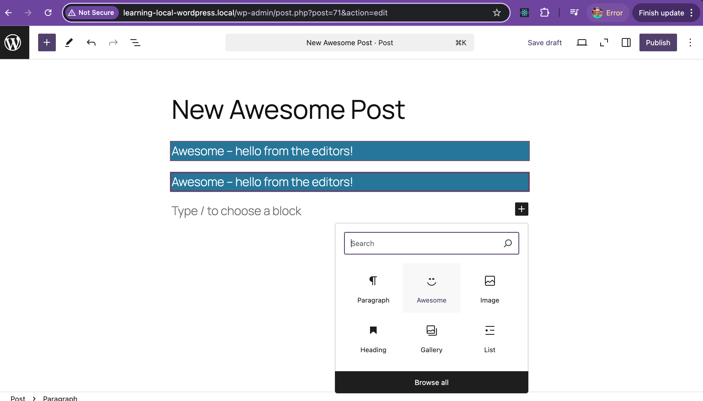
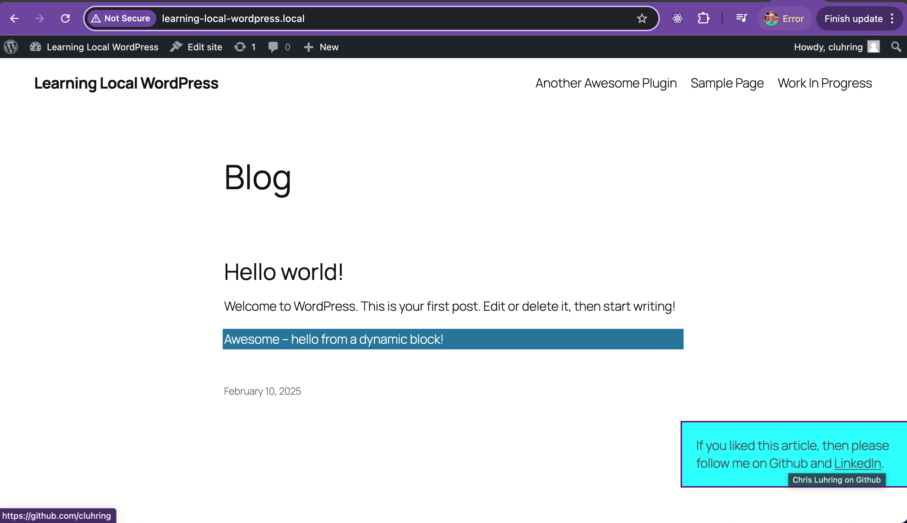

=== Chris Luhring's Second WP Pluggin - using Block Template ===
Contributors:      The WordPress Contributors
Tags:              block
Tested up to:      6.7
Stable tag:        0.1.0
License:           GPL-2.0-or-later
License URI:       https://www.gnu.org/licenses/gpl-2.0.html

Example block scaffolded with Create Block tool.

== Description ==

This block plugin was created using terminal command:
'npx @wordpress/create-block@latest awesome --variant dynamic --target-dir .'
following youtube tutorial: https://www.youtube.com/watch?v=syRi9p9aWYA 

== Installation ==

This section describes how to install the plugin and get it working.

1. Upload the plugin files to the `/wp-content/plugins/wp-plugin-block-template` directory
2. Activate the "Awesome" plugin through the 'Plugins' screen in WordPress

== Frequently Asked Questions ==

= A question that someone might have =

An answer to that question.

== Screenshots ==

1. This screenshot shows WordPress admin site - which now displays block plugin in block search bar
   
  
3. This screenshot shows WordPress site after the block plugin is saved in WP admin
   

== Changelog ==

= 0.1.0 =
* Release
